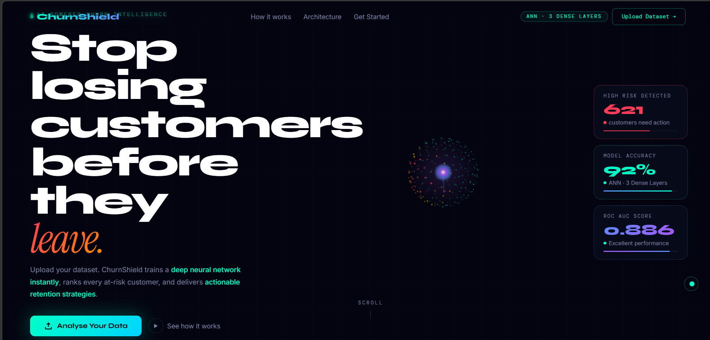
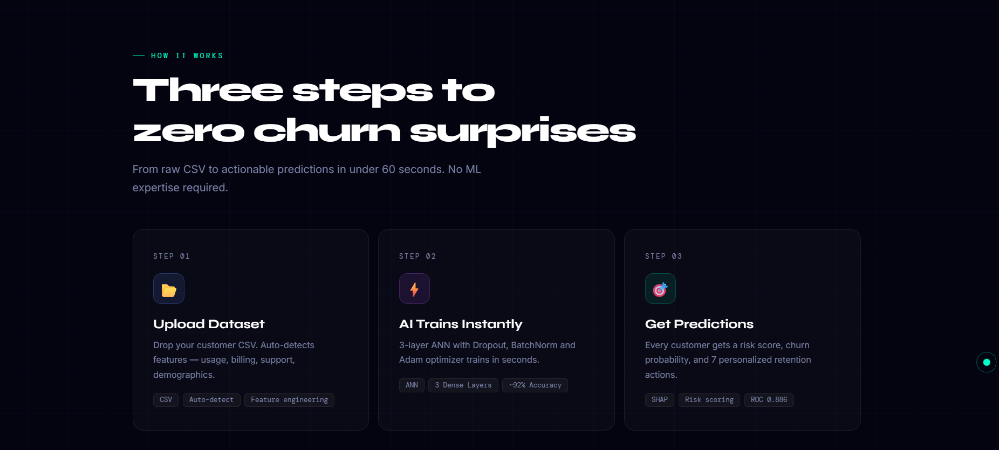
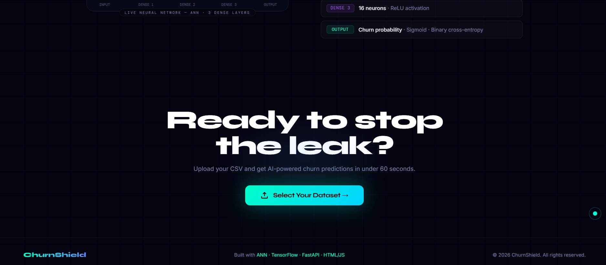
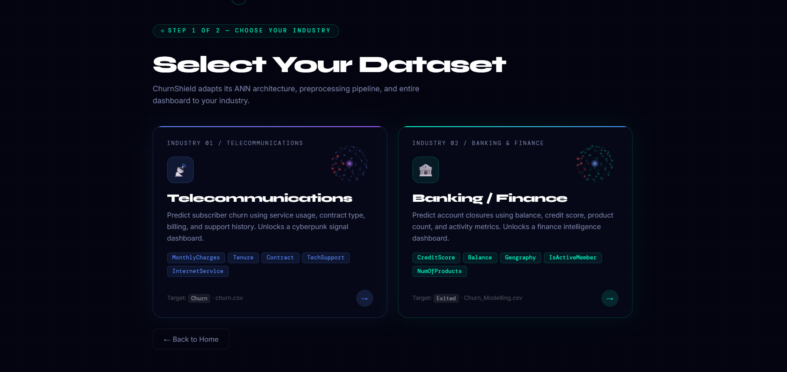
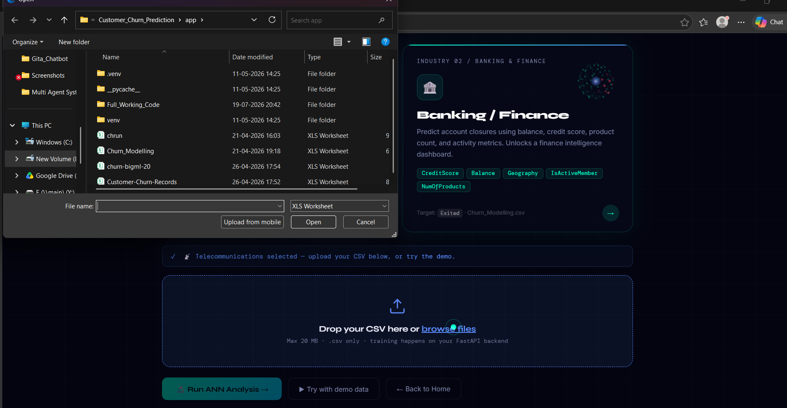
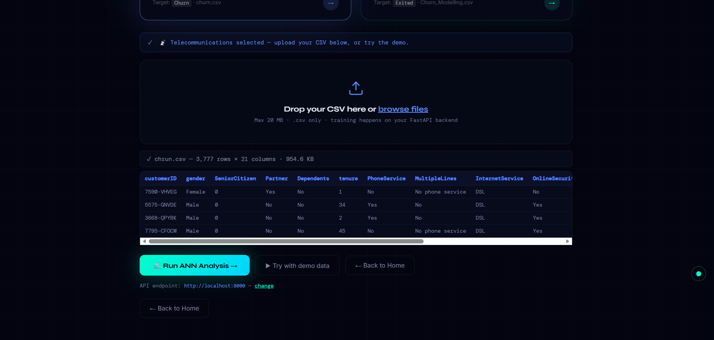
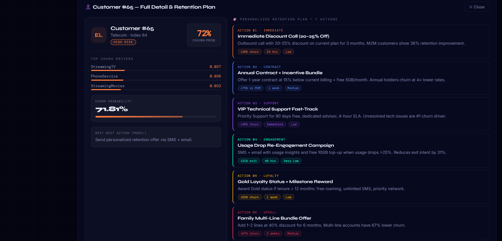
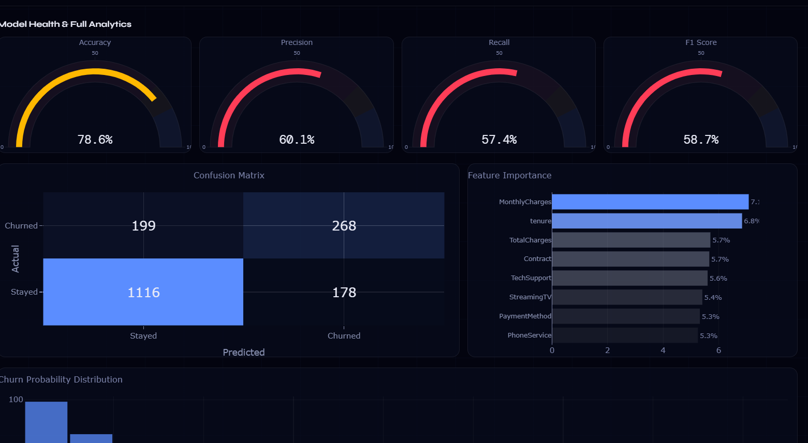
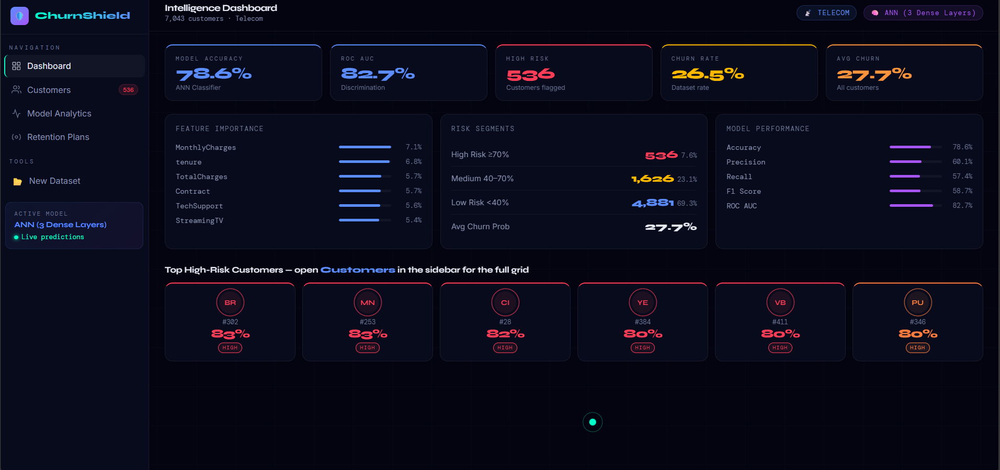
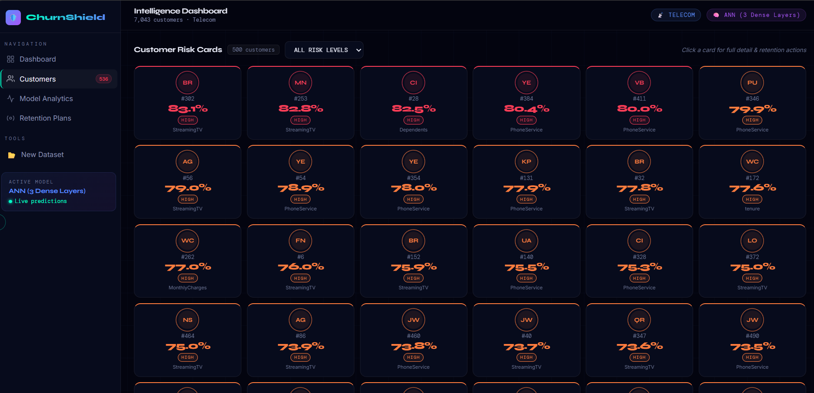

# 🛡️ ChurnShield — AI-Powered Customer Churn Intelligence Platform

**An end-to-end Machine Learning system that predicts *who* will churn, *why* they'll churn, and *what to do about it* — powered by a custom-trained Artificial Neural Network served through FastAPI, with a fully animated JavaScript dashboard on top.**

🎥 **Live Demo Video:** [Watch on LinkedIn](https://www.linkedin.com/in/mohit-jadav-)

---

## 📸 Preview

| Landing Page | How It Works + Neural Net Visual |
|---|---|
|  |  |

| Industry Selection | CSV Upload |
|---|---|
|  |  |

| Model Training | Dashboard Overview |
|---|---|
|  |  |

| Model Analytics — Gauges | Model Analytics — Confusion Matrix & Feature Importance |
|---|---|
|  |  |

| Customer Risk Grid | Customer Detail Panel |
|---|---|
|  |  |

More screenshots (CTA section, dashboard feature importance, retention plans) are in [`/screenshots`](./screenshots).

---

## 📋 Overview

ChurnShield takes a raw customer dataset (Telecom **or** Banking) as a CSV upload, trains a churn-prediction model **live, on the fly**, and returns a full intelligence package: accuracy metrics, per-customer churn probability, the top drivers behind each prediction, and a recommended retention action — all served from a single FastAPI backend and visualized in a zero-dependency HTML/CSS/JS frontend.

It's built as a real two-service ML architecture, not a notebook demo:

```
┌────────────────────────┐        POST /predict (multipart CSV)     ┌───────────────────────────┐
│   Frontend (SPA)         │ ─────────────────────────────────────▶ │   FastAPI Backend           │
│   index.html + app.js    │                                          │   main.py                    │
│                            │ ◀───────────────────────────────────  │                               │
└────────────────────────┘        JSON (metrics + predictions)        └─────────────┬─────────────┘
                                                                                       │
                                                                        ┌──────────────▼──────────────┐
                                                                        │  Preprocessing  →  Train/Test │
                                                                        │  Split  →  ANN (Keras) /       │
                                                                        │  RandomForest fallback         │
                                                                        └──────────────┬──────────────┘
                                                                                       │
                                                                        Feature importance · SHAP-style
                                                                        driver approximation · per-row
                                                                        risk scoring · next-best-action
```

---

## 🧠 The Model & Backend — How It Actually Works

This is the core of the project, so here's the full pipeline in detail.

### 1. Research & Prototyping (`Customer_Churn_Prediction.ipynb`)

The model design started in Jupyter, using the classic **`Churn_Modelling.csv`** banking dataset, before being productionized into the FastAPI service:

- Exploratory data analysis: correlation heatmaps, churn distribution by `Tenure`, `Age`, `Balance`, `CreditScore`, `Geography`, and `Gender` using Seaborn.
- Dropped non-predictive identifier columns (`RowNumber`, `CustomerId`, `Surname`).
- One-hot encoded categorical fields (`Geography`, `Gender`) with `drop_first=True` to avoid the dummy-variable trap.
- Scaled numerical columns (`CreditScore`, `Age`, `Tenure`, `Balance`, `NumOfProducts`, `EstimatedSalary`) with `MinMaxScaler`.
- Trained a Keras `Sequential` ANN and evaluated it with accuracy score, confusion matrix, and classification report.

This notebook is the R&D layer — `main.py` takes that same approach and hardens it into a general-purpose, dual-industry API.

### 2. Production Preprocessing (`main.py`)

The backend supports **two industries** out of the box, each with its own dedicated cleaning pipeline:

**Banking (`preprocess_bank`)**
- Drops `RowNumber`, `CustomerId`, `Surname`.
- One-hot encodes `Geography` and `Gender`.
- `MinMaxScaler` on `CreditScore`, `Age`, `Tenure`, `Balance`, `NumOfProducts`, `EstimatedSalary`.
- Target column: `Exited`.

**Telecom (`preprocess_telecom`)**
- Drops `customerID`.
- Fixes the well-known `TotalCharges` blank-string bug by coercing to numeric and imputing the median.
- Normalizes `"No internet service"` / `"No phone service"` down to a plain `"No"` across all service columns.
- Binary-encodes all `Yes`/`No` fields (`Partner`, `Dependents`, `PhoneService`, `PaperlessBilling`, `Churn`, service add-ons, etc.).
- One-hot encodes remaining categorical fields (`InternetService`, `Contract`, `PaymentMethod`).
- `MinMaxScaler` on `tenure`, `MonthlyCharges`, `TotalCharges`.
- Target column: `Churn`.
- A `safe_to_float()` guard sweeps the whole frame at the end and coerces any leftover string values, which is what prevents the classic **422 "could not convert string to float" crash** on messy real-world CSVs.

Industry can also be set to `"auto"`, in which case the API fingerprints the uploaded columns against known Banking/Telecom schema signatures and picks the right pipeline automatically.

### 3. The Model — ANN with a Classical ML Fallback

The primary model is a **Keras Artificial Neural Network**, trained fresh on every request:

```python
keras.Sequential([
    layers.Dense(64, activation="relu", input_shape=(input_dim,)),
    layers.BatchNormalization(),
    layers.Dropout(0.3),
    layers.Dense(32, activation="relu"),
    layers.BatchNormalization(),
    layers.Dropout(0.2),
    layers.Dense(16, activation="relu"),
    layers.Dense(1, activation="sigmoid"),
])
```

- **Optimizer:** Adam (`lr=0.001`) · **Loss:** binary cross-entropy · **Epochs:** 100 · **Batch size:** 100
- `validation_split=0.1` + `EarlyStopping(patience=10, restore_best_weights=True)` so it doesn't overfit or waste epochs
- Batch Normalization + Dropout on both hidden layers for stable, regularized training on small-to-medium tabular datasets

**No TensorFlow installed? No problem.** The backend auto-detects at import time and transparently swaps in a `RandomForestClassifier` (`n_estimators=200`, `max_depth=10`, `class_weight="balanced"`) so the API never goes down — this fallback is what makes the app deployable on lightweight hosts where TensorFlow is too heavy.

### 4. Explainability — Where the "Why" Comes From

Neural nets don't expose `.feature_importances_` like tree models do, so ChurnShield approximates it two ways:

- **Global importance:** absolute mean of the first Dense layer's weight matrix per input feature (normalized to sum to 1) — a lightweight proxy for "how much this feature moves the network."
- **Per-customer drivers:** a SHAP-style approximation — global importance × each customer's deviation from the feature's mean — ranked to surface the **top 3 drivers behind that specific person's risk score**.
- When running on the RandomForest fallback, native Gini-based `feature_importances_` are used directly instead.

### 5. Evaluation Metrics Computed Per Training Run

On a stratified 75/25 train/test split, the API reports:

| Metric | Description |
|---|---|
| Accuracy | Overall correct-prediction rate |
| Precision | Of predicted churners, how many actually churned |
| Recall | Of actual churners, how many were caught |
| F1 Score | Harmonic mean of precision & recall |
| ROC-AUC | Probability the model ranks a churner above a non-churner |
| Confusion Matrix | TP / FP / FN / TN breakdown |

### 6. Business Logic Layer

Every prediction is paired with a **rule-based "Next Best Action"**, keyed off the top driver and industry (e.g. a Telecom customer flagged for `MonthlyCharges` gets a discount offer; a Banking customer flagged for `Balance` gets a premium savings pitch) — turning a raw probability into something a retention team can actually act on.

### 7. REST API Surface

| Method | Route | Purpose |
|---|---|---|
| `GET` | `/` | API status + which model type is active (ANN/RF) |
| `GET` | `/health` | Health check, current loaded model & industry |
| `POST` | `/predict` | Upload CSV (`file`) + `industry` (`telecom`/`bank`/`auto`) → trains model, returns metrics, feature importances, segment summary, and up to 500 per-customer predictions |
| `GET` | `/results` | Re-fetch the last trained run's results without retraining |
| `POST` | `/whatif` | Send manual feature overrides → get an instant churn probability for a hypothetical customer |

CORS is fully open (`allow_origins=["*"]`) so the static frontend can call the API from any origin, including `file://` during local testing.

---

## 🎨 The Frontend — What It Does & How to Use It

The frontend is a **single-page app** (`index.html` + `app.js` + `fx.js` + `style.css`) with **zero build step** — no React, no bundler, just static files you can open in a browser.

### Features
- **Landing page** — animated 3D particle sphere, live neural-network canvas, animated stat counters, custom neon cursor.
- **Industry selection** — pick Telecom 📡 or Banking 🏦, each with its own mini rotating-sphere card and theme color.
- **CSV upload** — drag-and-drop your dataset, see an instant row × column preview before sending it to the API. No backend running? Hit **Demo Mode** to see the full experience on realistic simulated data (`js/demo.js`).
- **Training screen** — a macOS-style terminal animates the real preprocessing → training → evaluation pipeline while the actual `/predict` call runs in parallel.
- **Dashboard** — KPI cards, feature-importance bars, risk-segment breakdown, and top high-risk customers at a glance.
- **Customers view** — a filterable grid of every customer, click into any card for their full churn-driver breakdown, probability meter, and personalized retention actions.
- **Model Analytics** — Plotly.js gauges for Accuracy/Precision/Recall/F1, a confusion-matrix heatmap, a feature-importance bar chart, and a churn-probability histogram.
- **Retention Plans** — 7 ready-made retention strategies per industry with expected impact tags.

### How to Use It
1. Start the backend (see below) **or** skip it and click **Demo Mode**.
2. Open `index.html` in a browser (or serve the `frontend/` folder with any static server).
3. Pick your industry → upload a CSV (or use Demo Mode) → watch the training animation.
4. Explore the Dashboard, drill into individual Customers, check Model Analytics, and review the suggested Retention Plans.
5. Point the app at a different backend anytime via the **"change"** API URL link — it's saved to `localStorage`.

---

## 🛠️ Tech Stack

| Layer | Tools |
|---|---|
| Model | TensorFlow / Keras (ANN), scikit-learn (RandomForest fallback, preprocessing, metrics) |
| Backend API | FastAPI, Uvicorn, Pandas, NumPy |
| Frontend | Vanilla HTML5, CSS3, JavaScript (Canvas API for visuals) |
| Charts | Plotly.js 2.35 |
| Fonts | Syne, DM Mono, Instrument Serif, Inter (Google Fonts) |

---

## 📂 Project Structure

```
├── backend/
│   ├── main.py                 # FastAPI app — preprocessing, ANN/RF training, all routes
│   └── requirements.txt
├── notebooks/
│   └── Customer_Churn_Prediction.ipynb   # Original model R&D / EDA notebook
├── frontend/
│   ├── index.html              # SPA shell — all views
│   ├── css/style.css           # Dark-neon design system
│   └── js/
│       ├── app.js              # Router, upload, API client, dashboard rendering, Plotly charts
│       ├── fx.js               # 3D hero sphere, neural-net canvas, cursor, counters
│       └── demo.js             # Deterministic demo-mode result generator
├── screenshots/                # App screenshots used in this README
└── README.md
```

---

## 🚀 Getting Started

### 1. Clone the repository
```bash
git clone https://github.com/<your-username>/ChurnShield.git
cd ChurnShield
```

### 2. Set up and run the backend
```bash
cd backend
pip install -r requirements.txt
uvicorn main:app --reload --port 8000
```
> TensorFlow is optional. Without it, the backend automatically falls back to a RandomForest classifier — no code changes needed.

### 3. Open the frontend
Just open `frontend/index.html` in your browser, or serve it locally:
```bash
cd frontend
python -m http.server 5500
```
Then set the API URL to `http://localhost:8000` in the app (default), upload a CSV, and you're live.

### API Example
```bash
curl -X POST "http://localhost:8000/predict" \
  -F "file=@Churn_Modelling.csv" \
  -F "industry=bank"
```

---

## 🔲 Roadmap

- [ ] "What-If" simulator UI wired to the existing `POST /whatif` route
- [ ] CSV/PDF export of prediction results
- [ ] Persist and reload previous results via `GET /results` on page load
- [ ] Pagination beyond the current 60-card / 500-row limits
- [ ] SHAP (true, not approximated) for deeper explainability
- [ ] Dockerize backend + frontend for one-command deployment

---

## ⚠️ Disclaimer

Built for educational and portfolio purposes. Predictions are estimates based on the uploaded dataset and should not be used as the sole basis for real business retention decisions.

---

## 👤 Author

**Mohit Jadav**
[LinkedIn](https://www.linkedin.com/in/mohit-jadav-)

---

## 📄 License

This project is licensed under the MIT License.
